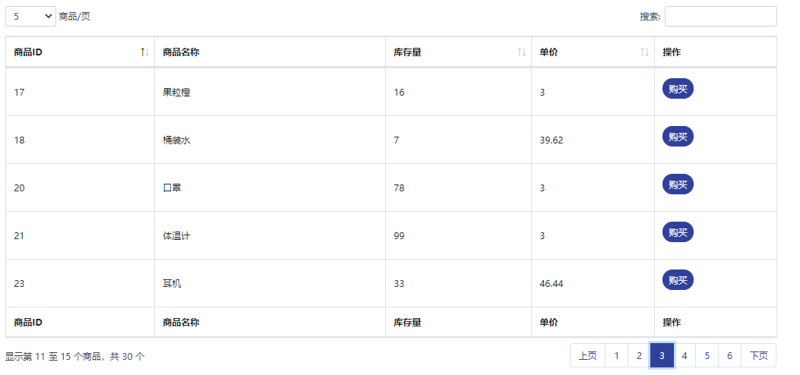
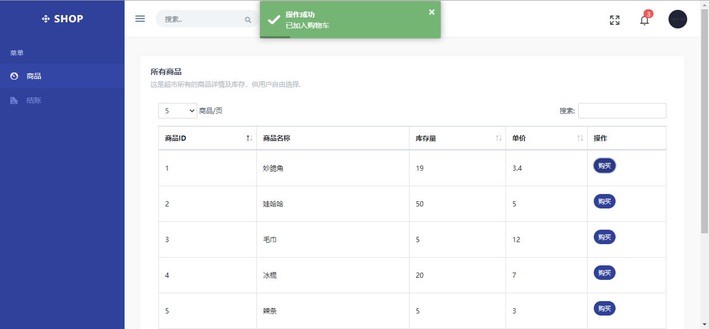
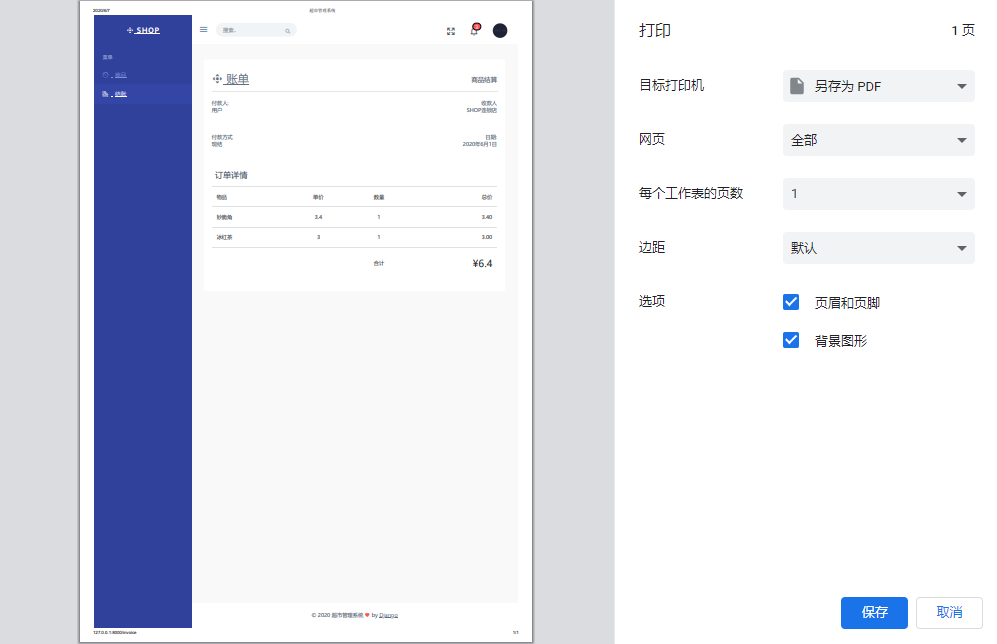

# Shop System
A simple shop that customers can select goods and view their order with Django

【Python实战作业】

这个项目使用Django实现了一个模拟超市购物结算的系统

#### 目录结构

├─database 		//商品数据

├─output 			//项目截图 

└─src 					//Django项目源码 

#### 页面预览

- 商品列表

- 选购商品

- 商品结算

- 打印账单

